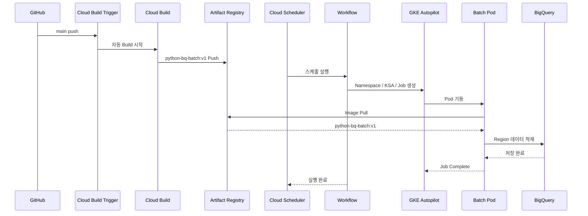

# Gcp_Managed_GKE_L2Comm

GKE Autopilot 기반 Python Batch를 **Cloud Build + Artifact Registry + Cloud Scheduler + Workflows + GKE Job**으로 실행하는 TO-BE PoC 구성입니다.

핵심 원칙은 **Image Build와 Batch Runtime을 분리**하는 것입니다.

- Git Source 변경 시에만 Container Image를 Build 합니다.
- 일반 Batch 실행 시에는 기존 Artifact Registry Image를 재사용합니다.
- Cloud Scheduler는 Workflow만 호출합니다.
- Workflow는 Namespace/KSA/Job을 생성하고 Job 완료를 대기합니다.
- GKE Job은 실행 완료 후 Pod가 종료됩니다.

---

# 1. AS-IS / TO-BE 차이

## AS-IS

```text
Shell Program
   ↓
Docker Build Template 실행
   ↓
Git 환경정보 / Source 적용
   ↓
Docker Container Image 생성
   ↓
Artifact Registry Push
   ↓
GKE Pod 생성
   ↓
업무 처리
   ↓
Pod 종료
```

AS-IS는 Shell Program이 Build와 Runtime 실행을 함께 제어하는 구조입니다.

## TO-BE

```text
[Image Build - Source 변경 시]
GitHub main push
   ↓
Cloud Build Trigger
   ↓
Cloud Build
   ↓
Artifact Registry
   ↓
python-bq-batch:v1 저장

[Batch Runtime - 매 실행 시]
Cloud Scheduler
   ↓
Workflow
   ↓
GKE Job
   ↓
Artifact Registry Image Pull
   ↓
Batch Pod
   ↓
Python main.py
   ↓
BigQuery 처리
   ↓
Job Complete / Pod 종료
```

| 구분 | AS-IS | TO-BE |
|---|---|---|
| 실행 제어 | Shell Program | Cloud Scheduler + Workflow |
| Image Build | Shell 흐름에 포함 가능 | Git Source 변경 시만 Cloud Build |
| Image 저장 | Artifact Registry | Artifact Registry |
| Runtime | Shell에서 Pod 실행 | Workflow에서 Kubernetes Job 생성 |
| 일반 Batch 실행 | Build 여부가 Shell 로직에 의존 | 기존 Image 재사용 |
| 종료 | Pod 종료 | Job Complete 후 Pod 종료 |
| 관리 방식 | Script 중심 | Managed Service 중심 |

---

# 2. TO-BE 전체 구성도

```mermaid
flowchart TB
    ADMIN[admin@sonmap.net / infra-son01]

    ADMIN --> B00[00-bootstrap]
    B00 --> N10[10-network]
    N10 --> I30[30-infra-manager]

    I30 --> GKE[GKE Autopilot\ngke-l2comm-batch-an3]
    I30 --> AR[Artifact Registry\nar-l2comm-python]
    I30 --> WF[Workflow\nwf-l2comm-gke-job]
    I30 --> CBT[Cloud Build Trigger\ntrg-l2comm-python-image]

    GIT[GitHub main push] --> CBT
    CBT --> CB[Cloud Build\nsa-l2comm-cloudbuild]
    CB --> IMG[python-bq-batch:v1]
    IMG --> AR

    SCH[Cloud Scheduler\nsch-l2comm-gke-job] --> WF
    WF --> NSKSA[Namespace / KSA 자동 생성\nl2comm-batch / ksa-l2comm-batch]
    NSKSA --> JOB[Kubernetes Job]
    JOB --> POD[Batch Pod]
    AR -->|Image Pull| POD

    NSKSA -. Workload Identity .-> RUNTIME[sa-l2comm-runtime]
    RUNTIME -. GCP API 권한 .-> POD

    POD --> BQ[BigQuery\npjt-c-admin.dlk_sample.gcp_region_inventory]
    BQ --> RESULT[43 rows 검증 완료]
```

---

# 3. 실행 시퀀스



---

# 4. 사전 설계 트리

```text
TO-BE
├─ 관리 / 구축
│  ├─ 00-bootstrap
│  │  ├─ API 활성화
│  │  ├─ Terraform State Bucket
│  │  ├─ Terraform SA
│  │  └─ Infrastructure Manager SA / IAM
│  │
│  ├─ 10-network
│  │  ├─ Shared VPC Service Project 연결
│  │  ├─ GKE Subnet
│  │  ├─ Pod Secondary Range
│  │  ├─ Service Secondary Range
│  │  └─ Shared VPC IAM
│  │
│  └─ 30-infra-manager
│     ├─ GKE Autopilot
│     ├─ Artifact Registry
│     ├─ Service Accounts
│     ├─ Workload Identity
│     ├─ Workflow
│     └─ Cloud Build Trigger
│
├─ CI/CD
│  ├─ GitHub
│  ├─ Cloud Build Trigger
│  ├─ Cloud Build
│  └─ Artifact Registry
│
├─ Runtime
│  ├─ Cloud Scheduler
│  ├─ Workflow
│  ├─ Namespace: l2comm-batch
│  ├─ KSA: ksa-l2comm-batch
│  ├─ GKE Job
│  └─ Batch Pod
│
└─ Data
   └─ pjt-c-admin
      └─ dlk_sample
         └─ gcp_region_inventory
```

---

# 5. 프로젝트 설계

| 구분 | Project ID | 역할 | 주요 자원 |
|---|---|---|---|
| Shared VPC Host | `gcp-prod-edp-hub-vpchost` | Network Host | VPC, GKE Subnet, Secondary Range, Network IAM |
| Edge / Runtime | `gcp-prod-edp-edge-509423` | GKE / CI-CD / Workflow 운영 | GKE, AR, Cloud Build Trigger, Workflow, Scheduler, SA |
| Data | `pjt-c-admin` | BigQuery 데이터 저장 | `dlk_sample.gcp_region_inventory` |

Target Region:

```text
asia-northeast3
```

---

# 6. Network / Subnet / IP 설계

## Shared VPC

| 항목 | 값 |
|---|---|
| Host Project | `gcp-prod-edp-hub-vpchost` |
| VPC | `vpc-prod-edp-hub` |
| Service Project | `gcp-prod-edp-edge-509423` |
| Region | `asia-northeast3` |
| GKE Subnet | `subnet-prod-edp-l2comm-gke-an3` |

## GKE CIDR

| 구분 | Range Name | CIDR | 용도 |
|---|---|---|---|
| Node Primary | Primary | `10.254.0.0/28` | GKE Node IP |
| Pod Secondary | `pods-prod-edp-l2comm-an3` | `10.254.2.0/23` | Pod IP |
| Service Secondary | `services-prod-edp-l2comm-an3` | `10.254.4.0/24` | ClusterIP Service |
| Control Plane | Master CIDR | `10.254.5.0/28` | Private GKE Control Plane |

현재 PoC 기준:

```text
Private GKE
Cloud NAT 없음
Shared VPC 사용
Private Google Access 사용
```

---

# 7. GKE 설계

| 항목 | 설계값 |
|---|---|
| Cluster | `gke-l2comm-batch-an3` |
| Type | GKE Autopilot |
| Region | `asia-northeast3` |
| Private Node | `true` |
| Private Endpoint | `true` |
| Workload Identity | 사용 |
| Namespace | `l2comm-batch` |
| KSA | `ksa-l2comm-batch` |
| Runtime GSA | `sa-l2comm-runtime` |
| Image | `python-bq-batch:v1` |
| Job 방식 | Workflow에서 Kubernetes Job 생성 |
| 종료 방식 | Job Complete 후 Pod 종료 |

현재 테스트 Pod Request / Limit:

```yaml
resources:
  requests:
    cpu: "250m"
    memory: "512Mi"
  limits:
    cpu: "250m"
    memory: "512Mi"
```

이 값은 Node 크기가 아니라 **업무 Pod의 Request / Limit**입니다.

---

# 8. Service Account / IAM 설계

## Service Account 목록

| Principal | 용도 |
|---|---|
| `admin@sonmap.net` | Bootstrap / Network / 관리 작업 |
| `sa-l2comm-tf-admin@gcp-prod-edp-edge-509423.iam.gserviceaccount.com` | Terraform 관리 |
| `sa-l2comm-inframgr@gcp-prod-edp-edge-509423.iam.gserviceaccount.com` | Infrastructure Manager Terraform 실행 |
| `sa-l2comm-cloudbuild@gcp-prod-edp-edge-509423.iam.gserviceaccount.com` | Docker Image Build / Push |
| `sa-l2comm-workflow@gcp-prod-edp-edge-509423.iam.gserviceaccount.com` | Workflow 실행 / GKE Job 생성 |
| `sa-l2comm-runtime@gcp-prod-edp-edge-509423.iam.gserviceaccount.com` | GKE Batch Pod Runtime |
| `ksa-l2comm-batch` | Kubernetes Service Account |
| `541022739403-compute@developer.gserviceaccount.com` | Autopilot Node 기본 SA / Image Pull |
| `service-541022739403@gcp-sa-cloudbuild.iam.gserviceaccount.com` | Cloud Build P4SA |

## 주요 IAM

| Principal | Scope | Role | 목적 |
|---|---|---|---|
| `sa-l2comm-inframgr` | Edge Project | `roles/config.agent` | Infrastructure Manager 실행 |
| `sa-l2comm-inframgr` | Edge Project | `roles/container.admin` | GKE 구성 |
| `sa-l2comm-inframgr` | Edge Project | `roles/cloudbuild.builds.editor` | Cloud Build Trigger 생성 |
| `sa-l2comm-inframgr` | Edge Project | `roles/resourcemanager.projectIamAdmin` | IAM Binding 구성 |
| `sa-l2comm-cloudbuild` | Edge Project | `roles/artifactregistry.writer` | Container Image Push |
| `sa-l2comm-cloudbuild` | Edge Project | `roles/logging.logWriter` | Build Log 기록 |
| `sa-l2comm-cloudbuild` | Edge Project | `roles/storage.objectViewer` | Build Source/Object 읽기 |
| `sa-l2comm-workflow` | Edge Project | `roles/container.developer` | Namespace/KSA/Job 생성 |
| `sa-l2comm-workflow` | Edge Project | `roles/workflows.invoker` | Workflow 실행 |
| `sa-l2comm-runtime` | Edge Project | `roles/bigquery.jobUser` | BigQuery Job 생성 |
| `sa-l2comm-runtime` | Edge Project | `roles/compute.viewer` | GCP Region 조회 |
| `sa-l2comm-runtime` | `pjt-c-admin:dlk_sample` | `roles/bigquery.dataEditor` | Target Table 적재 |
| `541022739403-compute@developer.gserviceaccount.com` | Edge Project | `roles/container.defaultNodeServiceAccount` | Autopilot Node 기본 권한 |
| `541022739403-compute@developer.gserviceaccount.com` | `ar-l2comm-python` | `roles/artifactregistry.reader` | GKE Image Pull |
| Cloud Build P4SA | Edge Project | `roles/secretmanager.admin` | GitHub Connection Secret 관리 |

## Workload Identity

```text
Batch Pod
   ↓
KSA: ksa-l2comm-batch
   ↓
roles/iam.workloadIdentityUser
   ↓
GSA: sa-l2comm-runtime
   ↓
Compute Regions API / BigQuery
```

---

# 9. CI/CD Image Build 설계

## 구성

| 순서 | 구성요소 | 이름 / 경로 | 역할 |
|---|---|---|---|
| 1 | GitHub | `sonmap/Gcp_Managed_GKE_L2Comm` | Source 저장 |
| 2 | Trigger | `trg-l2comm-python-image` | main push 감지 |
| 3 | Cloud Build | `cloudbuild/cloudbuild.yaml` | Docker Build |
| 4 | Artifact Registry | `ar-l2comm-python` | Image 저장 |
| 5 | Image | `python-bq-batch:v1` | Runtime Image |

## Build 원칙

```text
Git Source 변경
    ↓
Cloud Build Trigger
    ↓
Cloud Build 1회
    ↓
Artifact Registry 저장
```

Cloud Scheduler가 실행될 때마다 Image를 Build하지 않습니다.

Runtime은 기존 Image를 재사용합니다.

```text
Scheduler 실행
   ↓
Workflow
   ↓
GKE Job
   ↓
Artifact Registry에서 기존 Image Pull
   ↓
Pod 실행
```

---

# 10. Cloud Scheduler / Workflow 설계

| 항목 | 값 |
|---|---|
| Scheduler | `sch-l2comm-gke-job` |
| Workflow | `wf-l2comm-gke-job` |
| Workflow SA | `sa-l2comm-workflow` |
| Namespace | `l2comm-batch` |
| KSA | `ksa-l2comm-batch` |
| Job | `l2comm-*` |
| Workflow Job Wait Timeout | `1800s` |

Workflow 주요 처리:

```text
1. Namespace 존재 확인 / 없으면 생성
2. KSA 존재 확인 / 없으면 생성
3. Workload Identity Annotation 적용
4. Kubernetes Job 생성
5. Pod 실행
6. Job 완료 대기
7. Complete 반환
```

---

# 11. BigQuery 처리 설계

| 항목 | 값 |
|---|---|
| Project | `pjt-c-admin` |
| Dataset | `dlk_sample` |
| Table | `gcp_region_inventory` |
| Runtime SA | `sa-l2comm-runtime` |
| 처리 방식 | Python Batch → BigQuery Write |

현재 테스트 결과:

```text
Loading 43 GCP regions into pjt-c-admin.dlk_sample.gcp_region_inventory
Completed: pjt-c-admin.dlk_sample.gcp_region_inventory, rows=43
```

검증:

```sql
SELECT COUNT(*) AS row_count
FROM `pjt-c-admin.dlk_sample.gcp_region_inventory`;
```

결과:

```text
43
```

---

# 12. 적용 단계

## 00-bootstrap

실행 주체:

```text
admin@sonmap.net
```

```bash
cd terraform/00-bootstrap
terraform init
terraform plan
terraform apply
```

역할:

```text
API
Terraform State
Terraform SA
Infrastructure Manager SA
IAM
```

## 10-network

```bash
cd ../10-network
terraform init
terraform plan
terraform apply
```

역할:

```text
Shared VPC 연결
Subnet
Secondary CIDR
Network IAM
Secret Manager API
Cloud Build P4SA IAM
```

## 30-infra-manager

```bash
gcloud infra-manager deployments apply \
  projects/gcp-prod-edp-edge-509423/locations/asia-northeast3/deployments/l2comm-platform \
  --service-account=projects/gcp-prod-edp-edge-509423/serviceAccounts/sa-l2comm-inframgr@gcp-prod-edp-edge-509423.iam.gserviceaccount.com \
  --git-source-repo=https://github.com/sonmap/Gcp_Managed_GKE_L2Comm.git \
  --git-source-directory=terraform/30-infra-manager \
  --git-source-ref=main
```

생성 / 관리 대상:

```text
GKE Autopilot
Artifact Registry
Runtime / Workflow / Cloud Build SA
IAM
Workload Identity
Workflow
Cloud Build Trigger
```

## 40-scheduler

Cloud Scheduler는 현재 gcloud로 생성/운영합니다.

```text
Cloud Scheduler
   ↓
Workflow
   ↓
GKE Job
   ↓
Batch Pod
```

상세 명령:

```text
40-scheduler/README.md
```

---

# 13. 현재 Repository 구조

```text
Gcp_Managed_GKE_L2Comm/
├─ README.md
├─ app/
│  ├─ Dockerfile
│  ├─ main.py
│  └─ requirements.txt
├─ cloudbuild/
│  └─ cloudbuild.yaml
├─ helm/
│  └─ l2comm-batch/
│     ├─ Chart.yaml
│     ├─ values.yaml
│     └─ templates/
│        └─ serviceaccount.yaml
├─ 40-scheduler/
│  └─ README.md
└─ terraform/
   ├─ 00-bootstrap/
   ├─ 10-network/
   └─ 30-infra-manager/
      ├─ main.tf
      ├─ variables.tf
      ├─ terraform.tfvars.example
      └─ workflow.yaml.tftpl
```

현재 Workflow가 Namespace와 KSA를 자동 생성하므로 Helm Chart는 참고/보조 자원이며 Runtime 필수 단계는 아닙니다.

---

# 14. 운영 전 추가 결정 항목

| 항목 | 현재 | 운영 전 결정 |
|---|---|---|
| Scheduler 시간 | `09:00 Asia/Seoul` | 운영 배치 시간 확정 |
| Image Tag | `v1` | `v1` 유지 또는 Commit SHA / Version Tag 적용 |
| Job TTL | 미정 | 완료 Job 보관/자동 삭제 정책 |
| Monitoring | 기본 Logging | Dashboard / Alert 기준 |
| Error Retry | 기본 Workflow 결과 | Retry / 실패 알림 정책 |
| BigQuery Write | WRITE_TRUNCATE 기반 테스트 | 운영 적재 방식 확정 |

---

# 15. 최종 검증 상태

```text
GitHub main push
   ↓
Cloud Build Trigger
   ↓
Cloud Build SUCCESS
   ↓
Artifact Registry python-bq-batch:v1

Cloud Scheduler
   ↓
Workflow
   ↓
GKE Job
   ↓
Batch Pod
   ↓
BigQuery
   ↓
43 rows
   ↓
Job Complete 1/1
```

현재 PoC 기준 **CI/CD 자동 Build + Scheduler + Workflow + GKE Job + BigQuery 적재까지 End-to-End 검증 완료** 상태입니다.
